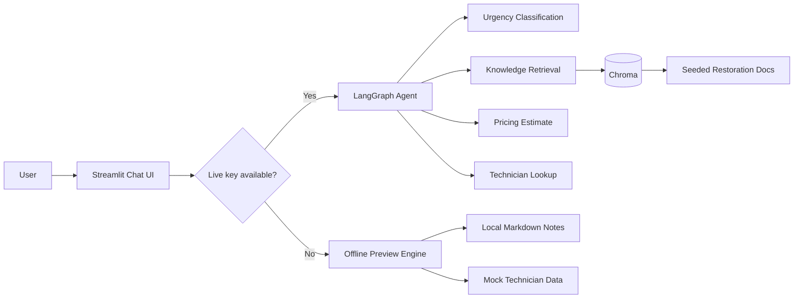

# Restoration Knowledge Assistant

[](https://github.com/brent-halen/Restoration_Knowledge_Assistant/actions/workflows/ci.yml)

Portfolio project for a single-agent AI assistant designed for restoration workflows. The app helps triage fire, water, and mold incidents, retrieve relevant operational guidance, provide deterministic ballpark estimates, and surface mock technician availability through a conversational interface.

## Overview

This project is intentionally built as a focused, single-agent system rather than a multi-agent demo. The goal is to show practical engineering judgment:

- clear tool boundaries
- structured outputs for safety-sensitive classification
- retrieval grounded in local knowledge sources
- graceful degradation when live AI calls are unavailable
- a UI that makes tool use visible instead of hiding it

## What The App Does

Given a damage scenario, the assistant can:

- classify urgency into a structured priority tier
- retrieve relevant notes from a small restoration knowledge base
- return deterministic pricing ranges for demo purposes
- look up mock technician availability
- show which tools were used to produce the answer

If an OpenAI API key is configured and quota is available, the app runs the full LangGraph agent. If not, it falls back to an offline preview mode so the product can still be demonstrated locally.

## Core Features

- **LangGraph ReAct agent** for tool selection and response orchestration
- **Streamlit chat UI** with visible tool-call traces
- **Knowledge retrieval** over local seeded restoration documents
- **Structured urgency classification** with Pydantic models
- **Deterministic pricing** to avoid hallucinated cost ranges
- **Mock dispatch lookup** for portfolio-friendly staffing workflows
- **Offline fallback mode** for demos without live API access
- **Basic automated tests** around deterministic domain logic

## Demo Modes

### Live agent mode

Used when `OPENAI_API_KEY` is present and the OpenAI project has available quota.

- LangGraph agent decides which tools to call
- OpenAI powers classification and final response generation
- Retrieval uses Chroma plus OpenAI embeddings

### Offline preview mode

Used when no key is configured or when a live call fails.

- heuristic urgency classification
- local keyword-based knowledge lookup
- deterministic pricing
- mock technician matching

This keeps the app usable as a product demo even when external dependencies are unavailable.

## Architecture



## Project Structure

```text
src/
  agent.py            LangGraph agent setup
  app.py              Streamlit interface
  config.py           Settings and environment loading
  eval.py             Evaluation harness
  knowledge_base.py   Chroma ingestion and retrieval setup
  models.py           Pydantic response schemas
  offline_demo.py     Offline preview logic
  smoke_test.py       One-command smoke-test entrypoint
  tools.py            Agent tools

data/
  knowledge/          Seeded markdown source documents
  technicians.json    Mock technician roster

tests/
  test_domain_logic.py
  test_eval.py
  test_offline_demo.py
```

## Local Setup

```powershell
python -m venv .venv
.venv\Scripts\Activate.ps1
python -m pip install -r requirements.txt
Copy-Item .env.example .env
streamlit run src/app.py
```

Add `OPENAI_API_KEY` to `.env` to enable live agent mode.

Python `3.14` worked during setup in this repo, but Python `3.12` or `3.13` is still the safer choice if you want the broadest package compatibility across the AI stack.

## Running The App

```powershell
.venv\Scripts\Activate.ps1
streamlit run src/app.py
```

Suggested prompts:

- `My basement has standing water from a burst pipe that started 20 minutes ago. What should I do first?`
- `Do you have technicians available for smoke damage cleanup?`
- `What would a moderate mold remediation job usually cost?`
- `What should I document for insurance after water damage?`

## Docker

The project includes a Docker image definition and a `compose.yaml` file for local containerized runs.

Build the image:

```powershell
docker build -t restoration-knowledge-assistant .
```

Run it directly:

```powershell
docker run --rm -p 8501:8501 --env-file .env -e CHROMA_PERSIST_DIR=/app/chroma_db restoration-knowledge-assistant
```

Or use Docker Compose:

```powershell
docker compose up --build
```

The compose setup mounts a named volume for `chroma_db` so the local Chroma collection can persist across restarts.

Container notes:

- the app still works without `OPENAI_API_KEY`, but it will run in offline preview mode
- live mode requires valid OpenAI credentials and available quota
- Streamlit is exposed on port `8501`

## Testing

```powershell
.venv\Scripts\Activate.ps1
python -m pytest -q
python -m src.eval --mode offline
python -m src.smoke_test --mode offline
```

Current test coverage is intentionally focused on deterministic logic and offline behavior so the repo can be verified locally without depending on live API calls.

GitHub Actions is configured to run `pytest` on Python `3.12` and `3.13` for every push and pull request.

## Validation

### Current local validation

- `pytest`: `8 passed`
- offline evaluation harness: `95.8%` average scenario score across 6 scenarios
- offline smoke test: successful triage plus mock dispatch response

Offline evaluation summary:

| # | Damage | Urgency | Tools | Score |
|---|--------|---------|-------|-------|
| 1 | PASS | PASS | PASS | 100.0% |
| 2 | PASS | FAIL | PASS | 75.0% |
| 3 | PASS | PASS | PASS | 100.0% |
| 4 | PASS | PASS | PASS | 100.0% |
| 5 | PASS | PASS | PASS | 100.0% |
| 6 | PASS | PASS | PASS | 100.0% |

Known miss:

- the offline heuristic currently over-escalates one mold scenario from `P3_standard` to `P2_urgent`

### Offline smoke test example

```text
User:
My basement has standing water from a burst pipe that started 20 minutes ago.
What should I do first, and do you have any technicians available?

Assistant:
Offline demo mode classified this as water_damage with urgency P1_emergency.

Why: Active water intrusion or contamination suggests immediate mitigation is needed.

Mock dispatch matches:
- Riley Chen: ETA 45 min, certs WRT, ASD
- Samira Brooks: ETA 60 min, certs WRT, AMRT
```

Live mode is implemented and wired, but it still depends on working OpenAI credentials, available quota, and outbound connectivity at runtime.

## Design Decisions

### Why single-agent

This scope does not need multi-agent orchestration. A single agent with well-defined tools is easier to debug, easier to evaluate, and more honest for a portfolio project.

### Why deterministic pricing

Cost ranges are one of the easiest places for an LLM demo to become misleading. This project keeps pricing deterministic so the assistant can explain ranges without inventing numbers.

### Why offline fallback

Portfolio projects are often reviewed under imperfect conditions. An offline path makes the app resilient during demos and keeps the UI and workflow reviewable even without live model access.

## Limitations

- technician data is mock, not tied to a real dispatch system
- pricing is directional and not based on line-item estimating
- the knowledge base is small and seeded with local markdown notes
- the project does not yet include image input or real claims-system integration
- live mode depends on OpenAI quota and connectivity

## What This Project Demonstrates

- agent architecture with explicit tools
- practical retrieval integration
- structured output design
- resilient UX under external-service failure
- product thinking around transparency and graceful degradation

## Documentation

- `docs/architecture.md`
- `docs/development.md`
